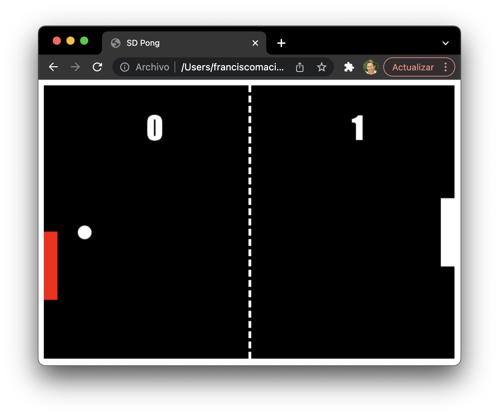

# Juego PONG Multijugador en Red

Sencillo _**juego PONG Multijugador 2D**_ creado para mostrar el funcionamiento de los _servicios **Websocket**_ para comunicaciones bidireccionales en tiempo real.

<!--  -->
<p style="text-align:center"></p>

El **Backend** del proyecto está basado en un **Motor de Red** implementado mediante un servidor _websocket_ basado en **NodeJS** y la biblioteca **Socket.IO**

El _**Frontend**_ del juego se ha implementado como una sencilla _página Web_ creada con _HTML_ y _JavaScript_.

La versión final *multijugador* implementa un *servidor web* que actúa de **Servidor de Juegos** y suministra a los clientes el _frontend_ del juego (contenido _HTML_), y un servidor _websocket_ que proporcona el **Motor de Red** (o _Network Engine_) que permite que  dos jugadores ubicados en _equipos_ (o _hosts_) diferentes puedan jugar al PONG.

En la sección **Versionado** se detallan las diferentes versiones. Fundamentalmente se ha creado una versión _Hombre-Máquina_ y una versión _Multijugador en red_.

## Comenzando 🚀

Estas instrucciones te permitirán obtener una copia del proyecto en funcionamiento en tu máquina local para propósitos de desarrollo y pruebas.

> :memo: **Note:** ver la sección **Deployment** para conocer cómo desplegar el proyecto.

### Pre-requisitos 📋

Se debe tener instalado **Node JS** en el equipo de desarrollo. Las siguientes líneas muestran cómo hacerlo para **Ubuntu 22.04**:

```sh
$ sudo apt update
$ sudo apt install nodejs npm
$ sudo npm i -g n
$ sudo n stable
```

Para el correcto visionado del juego se espera contar con la fuente **Impact** en el equipo. Las siguientes líneas muestran cómo instalar esta fuente de forma global en **Ubuntu 22.04**:

1. Descargar las fuentes de algún *sitio web* de confianza, por ejemplo:
> https://www.dafontfree.io/download/impact/?wpdmdl=56846&refresh=642deb3f62c3d1680730943&ind=1591711299933&filename=Impact-Font.zip

2. Nos moveremos a la carpeta de ```Desgargas/```...
```sh
$ cd
$ cd Descargas/
```

3. Descomprimir el archivo obtenido...
```sh
$ unzip Impact-Font.zip
```

4. Copiarlo en su ubicación destino... 

```sh
$ sudo cp ./impact.ttf /usr/local/share/fonts
```

### Instalación 🔧

En esta sección veremos cómo instalar y configurar el entorno de desarrollo para trabajar con el proyecto.

En primer lugar, debemos clonar el proyecto desde nuestro repositorio.

```sh
$ git clone https://pmacia@bitbucket.org/pmacia/pong.git
```

Una vez clonado el respositorio, debemos instalar y actualizar todas las bibliotecas de código y dependencias del proyecto:

```sh
$ cd pong
$ npm i
```

Para poner el proyecto en marcha, ejecutaremos el siguiente comando:

```sh
$ npm start
```

## Despliegue 📦

La versión de desarrollo se basa en un único servidor Node JS actuando como Servidor Web de páginas estáticas que proporciona la interfaz de usuario (GUI) y un servidor Web Socket que actúa como servidor de juegos.

> :warning: **Warning:** Deberá configurarse la *URL* con la dirección del *servidor de juegos*.

Para la versión de despliegue, debemos instalar un _Servidor Web **Apache2**_ o _**NginX**_ y copiar el contenido de la carpeta _`/public`_ en el lugar indicado para cada servidor.

Igualmente habrá que instalar el servidor de juegos basado en **Node JS** (que debe tener configurada las **CORS** para su correcto funcionamiento).

## Construido con 🛠️

En este apartado se detallan las principales herramientas que se ha empleado para crear el proyecto.

* [Socket.IO](https://socket.io/docs/v4/) - Biblioteca de código que proporciona comunicaciones de baja latencia, bidireccionales y basadas en eventos.
* [Express](https://expressjs.com/es/) - Infraestructura de aplicaciones web Node.js mínima y flexible que proporciona un conjunto sólido de características para las aplicaciones web y móviles.
* [nodemon](https://www.npmjs.com/package/nodemon) - Herramienta que ayuda a desarrollar aplicaciones basadas en node.js reiniciando automáticamente la aplicación de node cuando se detectan cambios de archivos en el directorio.

## Versionado 📌

Usamos [SemVer](http://semver.org/) para el versionado. Para todas las versiones disponibles, mira los [tags en este repositorio](https://bitbucket.org/pmacia/pong/tags).

En este respositorio se pueden encontrar la versión _Hombre-Máquina_ (_tag_ **v1.0.0**) y la versión _Multijugador en red_ (_tag_ **v2.0.0**):

tag    | Descripción
------ | ------------------------------------------
v1.0.0 | Juego Pong hombre-máquina básico (sin servidor web).
v2.0.0 | Juego Pong hombre-máquina desde un servidor web.
v3.0.0 | Juego Pong multijugador en red.

## Autores ✒️

Menciona a todos aquellos que ayudaron a levantar el proyecto desde sus inicios.

* **Paco Maciá** - *Trabajo Inicial* - [pmacia](https://github.com/pmacia)

---

## 🔐 License

All code and data are released under **Creative Commons Attribution-NonCommercial 4.0 International**. 
[](https://creativecommons.org/licenses/by-nc/4.0/)

Reuse is permitted with citation and acknowledgment of the MAS-MCP City authors.

---

## 🧾 Citation

> F. Maciá-Pérez,
> *Pong Multijugador en Red. Convirtiendo un juego clásico en Multijugador*,
> *Universidad de Alicante*, 2025.


